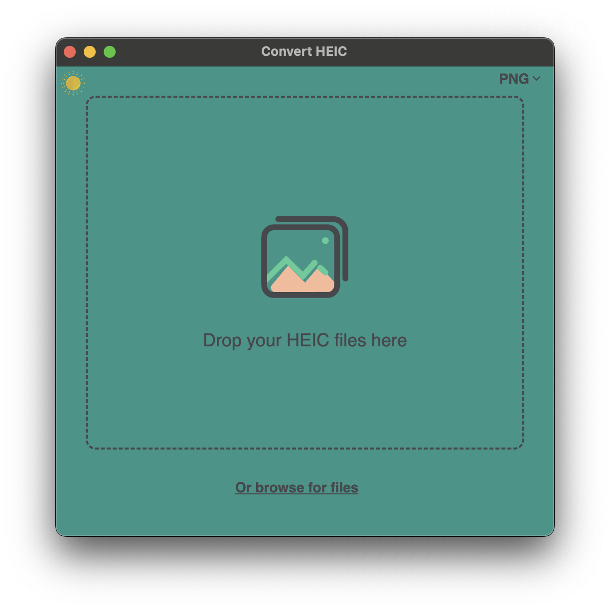
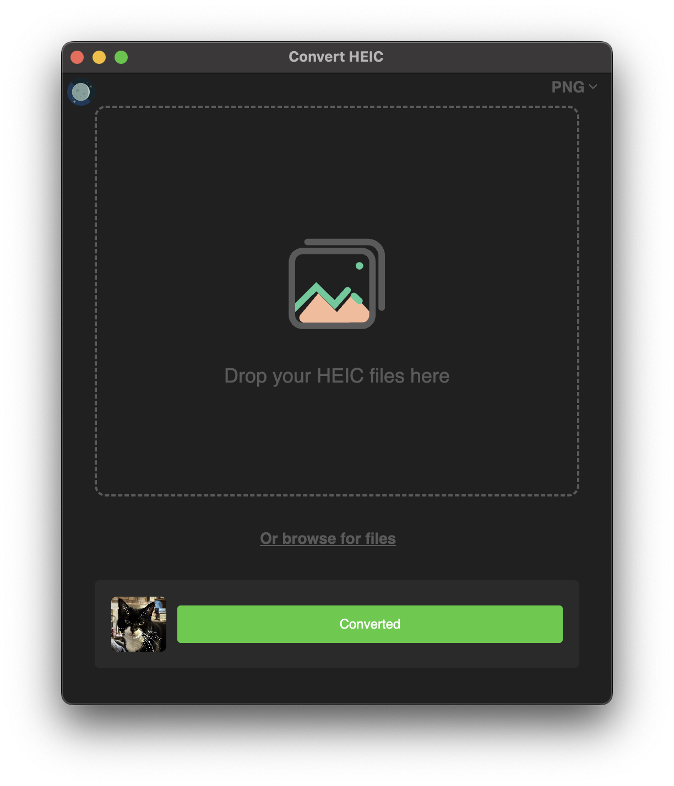

# convert-heic-electron

An Electron application with React and TypeScript to convert HEIC files to JPEG or PNG. This is a GUI wrapper for the npm package [heic-convert](https://github.com/catdad-experiments/heic-convert).

 

# Instructions

- Launch the app and either drag a .heic file or click the "Or browse for files" link then select a file. Your chosen image will be converted and saved to the same directory.
- Choose between converting to JPEG or PNG with the dropdown in the top right
- Toggle between dark and light theme by clicking the sun/moon icon in the top left

## Recommended IDE Setup

- [VSCode](https://code.visualstudio.com/) + [ESLint](https://marketplace.visualstudio.com/items?itemName=dbaeumer.vscode-eslint) + [Prettier](https://marketplace.visualstudio.com/items?itemName=esbenp.prettier-vscode)

## Project Setup

### Install

```bash
$ npm install
```

### Development

```bash
$ npm run dev
```

### Build

```bash
# For windows
$ npm run build:win

# For macOS
$ npm run build:mac

# For Linux
$ npm run build:linux
```
